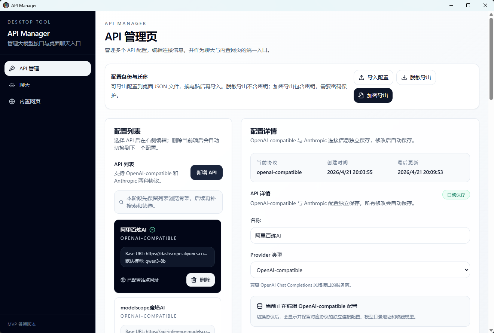
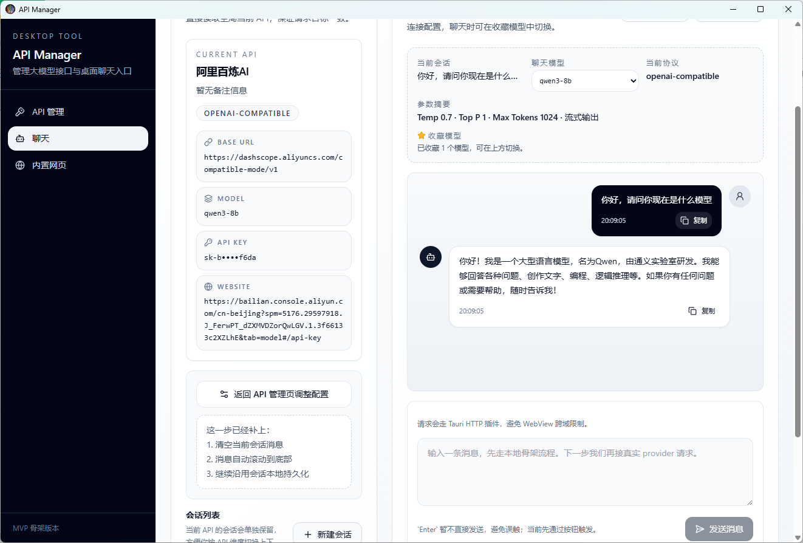
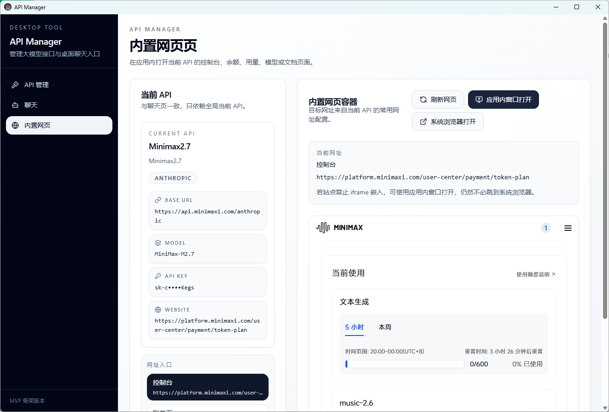

# API Manager

API Manager 是一个基于 Tauri 2、React、TypeScript、Tailwind CSS 和 Tailwind 风格 shadcn/ui 组件构建的 Windows 桌面工具，用于统一管理多个大模型 API 配置，并通过当前选中的 API 进行聊天、模型测试、配置迁移和 provider 控制台访问。

## 项目预览

### API 管理



### 聊天



### 内置网页



## 快速开始

如果你只是想直接使用软件，不需要安装 Node.js、Rust 或 Tauri 开发环境。

在 Windows 上直接运行项目根目录中的安装包即可：

```text
API Manager_0.1.0_x64-setup.exe
```

安装完成后，打开 API Manager，进入 API 管理页添加你的 API 配置即可开始使用。

如果你拿到的是源码仓库但没有安装包，请参考下方“本地开发”和“Windows 打包和安装流程”自行构建。

## 功能概览

- 管理多个 API 配置。
- 支持 OpenAI-compatible 协议。
- 支持 Anthropic API 协议。
- 每个 API 可独立保存 OpenAI-compatible 与 Anthropic 两套连接配置。
- 配置修改后自动保存，不需要手动点击保存按钮。
- 支持 Base URL、API Key、默认模型、备注、AI 描述等信息维护。
- 支持模型参数配置，包括 temperature、top_p、max_tokens、惩罚参数、system prompt 和是否流式输出。
- 支持拉取 OpenAI-compatible provider 的模型列表，并从列表中选择默认模型。
- 支持测试连接，并展示最近一次测试结果。
- 测试连接会尝试生成模型档案，包括模型名称、所属企业、参数规模、支持能力、适合场景和限制。
- 支持基于当前选中 API 的聊天。
- 聊天支持流式输出、非流式输出、停止回复、会话管理和本地历史持久化。
- 支持每个 API 配置多个常用网址，例如控制台、余额页、用量页、模型页、账单页、文档页。
- 支持在应用内 iframe 区域查看 provider 页面。
- 支持应用内独立窗口打开 provider 页面。
- 支持调用系统默认浏览器打开 provider 页面。
- 支持 API 配置脱敏导出。
- 支持 API 配置加密导出，包含 API Key。
- 支持导入普通 JSON 或加密 JSON 配置文件。
- 导出文件默认保存到 Windows 桌面，并在页面显示完整保存路径。

## 技术栈

- Tauri 2
- React 18
- TypeScript
- Vite
- Tailwind CSS
- shadcn/ui 风格组件
- Tauri HTTP Plugin
- Tauri Shell Plugin
- Rust 后端命令，用于桌面文件导出

## 项目结构

```text
.
├── src/                         # 前端 React 源码
│   ├── app/                     # 应用布局、路由、Provider
│   ├── components/              # 通用 UI 与业务组件
│   ├── lib/                     # 工具函数
│   ├── modules/                 # 业务模块与 provider 适配器
│   ├── pages/                   # 页面组件
│   ├── styles/                  # 全局样式
│   └── types/                   # TypeScript 类型定义
├── src-tauri/                   # Tauri / Rust 桌面端工程
│   ├── capabilities/            # Tauri 权限配置
│   ├── icons/                   # 应用图标
│   ├── src/                     # Rust 入口与命令
│   ├── Cargo.toml
│   └── tauri.conf.json
├── docs/                        # 文档
├── package.json
├── package-lock.json
├── tailwind.config.ts
├── vite.config.ts
└── README.md
```

## 核心页面

### API 管理页

用于维护 API 配置，是整个应用的主工作台。

主要能力：

- 新增、删除、选择 API 配置。
- 修改字段后自动保存。
- 为同一个 API 分别维护 OpenAI-compatible 和 Anthropic 配置。
- 配置 API Key，并默认隐藏显示。
- 复制 API Key 后会尝试在 30 秒后清空剪贴板。
- 拉取模型列表。
- 配置默认模型。
- 配置模型参数。
- 配置多个 provider 相关网址。
- 测试连接并生成模型档案。
- 导入和导出配置文件。

### 聊天页

基于当前选中的 API 进行对话。

主要能力：

- 每个 API 独立保存聊天会话。
- 支持新建、切换、重命名、删除和清空会话。
- 支持流式输出。
- 支持非流式输出。
- 支持停止生成。
- 切换到其它页面后，聊天状态不会被卸载。
- 请求会读取当前 API 的默认模型和模型参数。

### 内置网页页

用于查看 provider 控制台、余额、账单、文档等页面。

主要能力：

- 支持多个网址入口。
- 支持 iframe 内嵌查看。
- 支持应用内独立窗口打开。
- 支持系统浏览器打开。
- 如果网站禁止 iframe 嵌入，可以使用应用内窗口或系统浏览器打开。

## API 配置字段

每个 API 配置主要包含：

- 名称
- provider 类型
- 备注
- AI 描述
- 常用网址列表
- OpenAI-compatible 连接配置
- Anthropic 连接配置
- 最近一次测试结果
- 创建时间
- 更新时间

每套 provider 连接配置包含：

- Base URL
- API Key
- 默认模型
- 模型参数

模型参数包含：

- temperature
- top_p
- max_tokens
- presence_penalty
- frequency_penalty
- 是否流式输出
- system prompt

## 测试连接说明

测试连接分为两个阶段：

1. 基础连通性测试。
2. 模型档案测试。

OpenAI-compatible provider 会优先请求：

```text
GET /models
```

如果 `/models` 可用，则认为基础连接可用。

随后应用会尝试请求：

```text
POST /chat/completions
```

用于生成模型档案，模型档案会写入 `AI 描述` 字段。

模型档案会尽量包含：

- 模型名称
- 所属企业或机构
- 参数规模
- 支持能力，例如文字、图像、语音、视频、文档、代码、工具调用等
- 适合场景
- 主要限制
- 一句话总结

如果 provider 在模型档案测试阶段返回 `529 overloaded` 或网络错误，基础连接结果仍然保留。也就是说，模型能拉取成功时，测试不会因为附加测速失败而直接判定整个 API 不可用。

## 导入和导出

API 管理页顶部提供配置迁移功能。

### 脱敏导出

脱敏导出不包含 API Key，适合：

- 备份配置结构
- 上传 GitHub Issue
- 分享 provider 配置模板
- 在不包含密钥的情况下迁移基础配置

导出文件默认保存到桌面：

```text
C:\Users\你的用户名\Desktop\api-manager-safe-export-YYYY-MM-DD.json
```

### 加密导出

加密导出包含 API Key，适合换电脑完整迁移。

加密方式：

- PBKDF2
- AES-GCM
- 随机 salt
- 随机 iv

导出时需要输入密码。应用不会保存这个密码，导入时需要再次输入。

导出文件默认保存到桌面：

```text
C:\Users\你的用户名\Desktop\api-manager-encrypted-export-YYYY-MM-DD.json
```

### 导入配置

支持导入：

- 脱敏 JSON 配置文件
- 加密 JSON 配置文件

导入加密文件时，需要输入导出时设置的密码。

导入后的配置会合并到当前 API 列表顶部，不会覆盖已有配置。

## 本地开发

### 环境要求

- Node.js 18 或更高版本
- npm
- Rust 工具链
- Windows WebView2 Runtime
- Tauri 2 所需系统依赖

### 安装依赖

```powershell
npm install
```

### 启动开发环境

```powershell
npm run tauri:dev
```

### 前端构建检查

```powershell
npm run build
```

### Tauri 开发命令

也可以直接使用：

```powershell
npm run tauri dev
```

## Windows 打包和安装流程

如果另一台电脑只拿到 GitHub 源码，它仍然需要安装 Node.js、npm、Rust 和 Tauri 构建环境。

如果另一台电脑拿到的是构建后的安装包或 exe，它不需要安装开发环境。

### 1. 开发电脑准备环境

只需要开发电脑安装这些环境：

- Node.js 18 或更高版本
- npm
- Rust 工具链
- Tauri 2 所需 Windows 构建依赖
- Windows WebView2 Runtime

另一台运行软件的电脑不需要安装 Node.js、npm、Rust 或 Tauri。

### 2. 开发电脑安装依赖

在项目根目录运行：

```powershell
npm install
```

### 3. 开发电脑执行打包

```powershell
npm run package:windows
```

等价命令：

```powershell
npm run tauri:build
```

### 4. 找到打包产物

推荐分发 NSIS 安装包：

```text
src-tauri\target\release\bundle\nsis\*.exe
```

如果只想复制主程序，也可以使用：

```text
src-tauri\target\release\api-manager.exe
```

推荐优先把 NSIS 安装包发给另一台电脑，而不是只复制 `api-manager.exe`。安装包更符合 Windows 软件分发方式，也更容易处理安装路径和快捷方式。

完整说明见 [Windows 打包与分发说明](docs/PACKAGING.md)。

### 5. 分发给另一台电脑

推荐把这个安装包复制到另一台电脑：

```text
src-tauri\target\release\bundle\nsis\*.exe
```

另一台电脑双击安装包即可安装运行，不需要安装开发环境。

### 6. 另一台电脑直接运行 exe

如果不想安装，也可以尝试复制这个文件：

```text
src-tauri\target\release\api-manager.exe
```

然后在另一台电脑上双击运行。

注意：直接运行主程序时，如果目标电脑缺少 Microsoft Edge WebView2 Runtime，应用可能无法启动。Windows 10/11 大多数环境通常已经具备该运行时；如果没有，需要单独安装 WebView2 Runtime。

### 7. 打包验证

建议在开发电脑完成打包后先验证：

```powershell
src-tauri\target\release\api-manager.exe
```

如果主程序可以启动，再把 NSIS 安装包复制到另一台电脑测试安装。

### 8. 发布到 GitHub 的建议

不要把打包产物提交到 Git 仓库：

```text
src-tauri/target/
dist/
node_modules/
```

如果要公开发布安装包，推荐使用 GitHub Releases 上传：

```text
src-tauri\target\release\bundle\nsis\*.exe
```

源码仓库只保留代码、配置和文档；安装包作为 Release 附件发布。

## 安全注意事项

不要把任何真实密钥、令牌、证书或本地私有配置提交到 GitHub。

禁止提交的内容包括：

- `.env`、`.env.local`、`.env.production` 等环境变量文件
- OpenAI、Anthropic、Ollama 网关或其它 provider 的真实 API Key
- API Manager 加密导出的完整配置文件，如果其中包含真实 API Key
- Tauri 签名私钥，例如 `TAURI_SIGNING_PRIVATE_KEY`
- Windows 代码签名证书，例如 `.pfx`、`.p12`
- SSH 私钥、TLS 私钥、`.pem`、`.key`、`.crt`、`.cer`
- 本地构建产物，例如 `dist/`、`src-tauri/target/`
- 依赖目录，例如 `node_modules/`
- IDE 本地配置、系统缓存、日志文件

如果后续需要提供配置示例，请使用 `.env.example`，并只填写占位符：

```env
VITE_EXAMPLE_API_BASE_URL=https://api.example.com/v1
VITE_EXAMPLE_API_KEY=replace-with-your-own-key
```

## GitHub 上传前检查

上传前建议执行：

```powershell
git status --short
```

确认不要出现以下内容：

```text
node_modules/
dist/
src-tauri/target/
.env
*.key
*.pem
*.pfx
*.p12
```

如果这些文件已经被加入暂存区，需要先从 Git 索引中移除，但保留本地文件：

```powershell
git rm -r --cached node_modules dist src-tauri/target
```

如果误加入了密钥文件，请先移除索引并轮换对应密钥：

```powershell
git rm --cached .env
```

## 当前限制和后续计划

当前本地 API 配置仍保存在应用本地存储中。加密导出可以保护迁移文件，但本地 API Key 还没有迁移到 Windows Credential Manager、DPAPI 或 keyring 等系统级安全存储。

后续建议：

- 使用 Tauri/Rust 侧安全存储 API Key。
- 增加更详细的 provider 健康检查。
- 增加 token 用量统计。
- 增加模型横向对比测试。
- 支持更多 provider，例如 Gemini、DeepSeek、OpenRouter、Groq、Azure OpenAI、Ollama、LM Studio。

## License

本项目使用 MIT License 开源。

这意味着你可以自由使用、复制、修改、分发和二次开发本项目，但需要保留原始版权声明和许可证文本。完整条款见 [LICENSE](LICENSE)。
